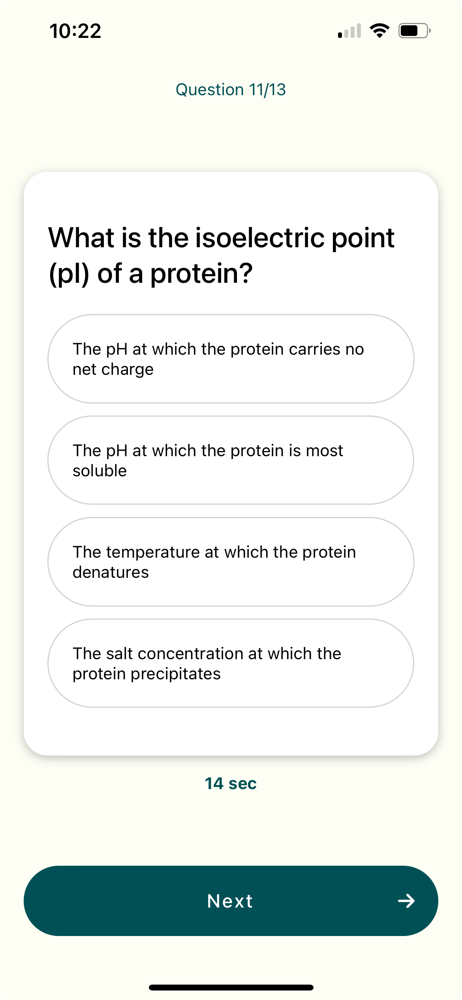
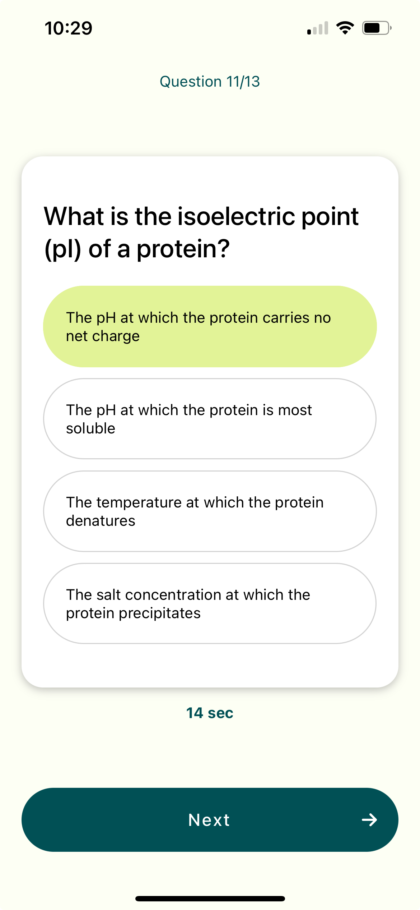
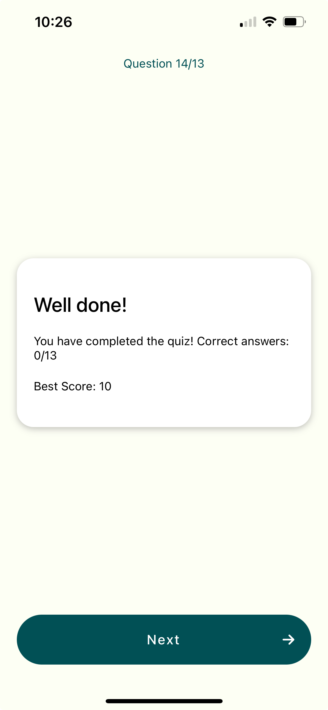

# React Native Quiz App

A React Native Quiz App that provides a seamless and interactive experience for users to take quizzes. The app features custom components for displaying questions, options, and navigating through the quiz. Perfect for educational purposes or just for fun!

## Features

- **QuizProvider**: Manages the state of the quiz and provides the context for other components.
- **QuestionCard**: Displays individual quiz questions and their possible answers.
- **AnswerOption**: Represents each answer option within a question.
- **Card**: A reusable component for displaying content in a card-like UI.
- **CustomButton**: A customizable button component for various actions within the app.

## Screenshots

### Question Screen



### Answer Screen



### Final Score Screen



## Installation

1. **Clone the repository**:

   ```bash
   git clone https://github.com/cesco345/react-native-quiz-app.git
   cd react-native-quiz-app
   ```

2. **Install dependencies**:

   ```bash
   npm install
   ```

3. **Run the app**:
   ```bash
   npm start
   ```

## Usage

1. **Start the development server**:

   ```bash
   npm start
   ```

2. **Run on an iOS or Android emulator**:
   - For iOS: Press `i` to open in iOS Simulator.
   - For Android: Press `a` to open in Android Emulator.

## File Structure

- **QuizProvider.tsx**: Manages the quiz state and context.
- **QuestionCard.tsx**: Component to display a quiz question and its answer options.
- **AnswerOption.tsx**: Component for each answer option within a quiz question.
- **Card.tsx**: Reusable card component.
- **CustomButton.tsx**: Customizable button component for various actions.

## License

This project is licensed under the MIT License. See the [LICENSE](LICENSE) file for details.

## Contact

If you have any questions, feel free to open an issue or contact the repository owner at fpiscani@stem-apks.com.

---

Happy quizzing!
